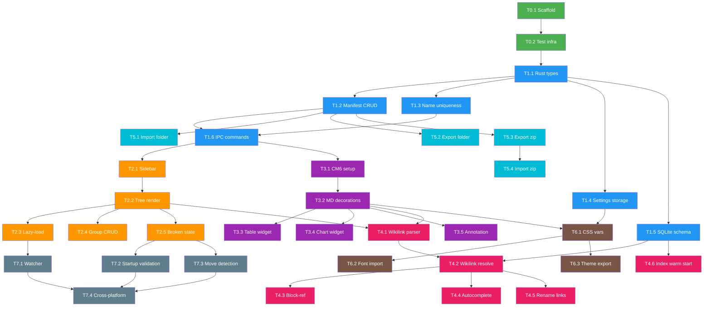

# Task Breakdown — Collection-based Markdown Note App

**Tham chiếu**: [documentation.md](file:///d:/Code/Collection/documentation.md)

---

## Mục lục

1. [Tổng quan Phases](#1-tổng-quan-phases)
2. [Thiết lập dự án & Testing](#2-thiết-lập-dự-án--testing)
3. [Thư viện & Dependencies](#3-thư-viện--dependencies)
4. [Phase 0 — Scaffolding & Infra](#4-phase-0--scaffolding--infra)
5. [Phase 1 — Core Data Layer](#5-phase-1--core-data-layer)
6. [Phase 2 — Collection Tree UI](#6-phase-2--collection-tree-ui)
7. [Phase 3 — Editor Engine](#7-phase-3--editor-engine)
8. [Phase 4 — Linking System](#8-phase-4--linking-system)
9. [Phase 5 — Import / Export](#9-phase-5--import--export)
10. [Phase 6 — Theming](#10-phase-6--theming)
11. [Phase 7 — Polish & Hardening](#11-phase-7--polish--hardening)

---

## 1. Tổng quan Phases

```mermaid
gantt
    title Dependency flow giữa các Phase
    dateFormat X
    axisFormat %s

    section Foundation
    P0 Scaffolding           :p0, 0, 1
    P1 Core Data Layer       :p1, after p0, 2

    section UI
    P2 Collection Tree UI    :p2, after p1, 2
    P3 Editor Engine         :p3, after p1, 3

    section Features
    P4 Linking System        :p4, after p2, 2
    P5 Import/Export         :p5, after p1, 2
    P6 Theming               :p6, after p3, 1

    section Hardening
    P7 Polish & Hardening    :p7, after p4, 1
```



| Phase | Phụ thuộc | Mô tả |
|-------|-----------|-------|
| P0 | — | Khởi tạo project Tauri + Vite + SolidJS, CI, lint, test infra |
| P1 | P0 | Collection manifest CRUD, storage layout, settings, SQLite link index schema |
| P2 | P1 | Sidebar tree, lazy-load folder-ref, group CRUD, drag-drop, broken state |
| P3 | P1 | CodeMirror 6 với 3 mode, bảng, chart, annotation |
| P4 | P2 + P3 | Wikilink, block-ref, global link index, autocomplete, resolve |
| P5 | P1 | Import folder, export folder/zip, import zip (code path riêng) |
| P6 | P3 | CSS variable theming, font import, theme export/import |
| P7 | All | File watcher, startup validation, move detection, cross-platform hardening |

---

## 2. Thiết lập dự án & Testing

### 2.1 Testing strategy — 4 layers

| Layer | Tool | Chạy khi nào | Scope |
|-------|------|-------------|-------|
| **Rust unit** | `cargo test` + `tauri::test` + `mockall` | Mỗi commit (CI) | Manifest CRUD, link index query, UUID gen, schema validation |
| **Rust integration** | `cargo test` + `tempfile` + `assert_fs` | Mỗi commit (CI) | File I/O, zip round-trip, watcher events, SQLite rebuild |
| **Frontend unit** | `vitest` + `happy-dom` | Mỗi commit (CI) | CM6 extensions, wikilink parser, YAML chart spec, theme logic |
| **E2E** | `tauri-driver` + `webdriverio` | Pre-release / nightly | Full flow: tạo collection → thêm file → edit → export → import |

### 2.2 CI — GitHub Actions

```yaml
# .github/workflows/ci.yml
name: CI
on: [push, pull_request]

jobs:
  rust-tests:
    strategy:
      matrix:
        os: [ubuntu-latest, windows-latest]
    runs-on: ${{ matrix.os }}
    steps:
      - uses: actions/checkout@v4
      - uses: dtolnay/rust-toolchain@stable
      - name: Linux deps
        if: runner.os == 'Linux'
        run: |
          sudo apt-get update
          sudo apt-get install -y libwebkit2gtk-4.1-dev \
            libappindicator3-dev librsvg2-dev patchelf
      - uses: actions/cache@v4
        with:
          path: |
            ~/.cargo/registry
            ~/.cargo/git
            src-tauri/target
          key: ${{ runner.os }}-cargo-${{ hashFiles('**/Cargo.lock') }}
      - run: cargo test --workspace
        working-directory: src-tauri

  frontend-tests:
    runs-on: ubuntu-latest
    steps:
      - uses: actions/checkout@v4
      - uses: actions/setup-node@v4
        with: { node-version: 20 }
      - run: npm ci
      - run: npm run test -- --reporter=verbose

  e2e:
    if: github.ref == 'refs/heads/main'
    strategy:
      matrix:
        os: [ubuntu-latest, windows-latest]
    runs-on: ${{ matrix.os }}
    steps:
      - uses: actions/checkout@v4
      - uses: dtolnay/rust-toolchain@stable
      - uses: actions/setup-node@v4
        with: { node-version: 20 }
      - name: Linux deps
        if: runner.os == 'Linux'
        run: |
          sudo apt-get update
          sudo apt-get install -y libwebkit2gtk-4.1-dev \
            libappindicator3-dev librsvg2-dev patchelf \
            webkit2gtk-driver xvfb
      - run: npm ci
      - run: npx tauri build --debug
      - run: cargo install tauri-driver
      - name: E2E (Linux)
        if: runner.os == 'Linux'
        run: xvfb-run npm run test:e2e
      - name: E2E (Windows)
        if: runner.os == 'Windows'
        run: npm run test:e2e
```

### 2.3 Folder structure dự kiến

```
project-root/
├── src-tauri/
│   ├── src/
│   │   ├── main.rs
│   │   ├── collection/          # manifest CRUD, schema types
│   │   ├── fs_layer/            # watcher, file-id lookup, lazy read
│   │   ├── link_index/          # SQLite index, query
│   │   ├── import_export/       # folder import, zip export/import
│   │   └── commands/            # Tauri IPC command handlers
│   ├── tests/                   # Rust integration tests
│   └── Cargo.toml
├── src/
│   ├── components/
│   │   ├── tree/                # Collection sidebar tree
│   │   ├── editor/              # CM6 wrapper, mode toggle
│   │   ├── theme/               # Theme settings panel
│   │   └── common/              # Shared UI components
│   ├── lib/
│   │   ├── cm-extensions/       # CM6 custom extensions
│   │   ├── wikilink/            # Parser, resolver
│   │   └── chart/               # YAML → Chart.js bridge
│   ├── stores/                  # SolidJS reactive stores
│   ├── App.tsx
│   └── index.tsx
├── tests/                       # Frontend unit tests
├── e2e/                         # E2E test specs
├── package.json
├── vite.config.ts
├── vitest.config.ts
└── tsconfig.json
```

---

## 3. Thư viện & Dependencies

### 3.1 Rust — `Cargo.toml`

```toml
[dependencies]
# --- Core ---
tauri = { version = "2.5", features = ["devtools"] }
tauri-plugin-dialog = "2.2"             # native file/folder picker
tauri-plugin-fs = "2.3"                 # extended FS access from frontend
serde = { version = "1.0", features = ["derive"] }
serde_json = "1.0"

# --- Data ---
uuid = { version = "1.17", features = ["v4"] }
chrono = { version = "0.4", features = ["serde"] }
rusqlite = { version = "0.35", features = ["bundled"] }  # link index DB

# --- File System ---
notify = "8.0"                          # file watcher (cross-platform)
zip = "4.1"                             # zip/unzip cho import/export
blake3 = "1.8"                          # content hash cho relink suggestion
dirs = "6.0"                            # app-data directory resolution

# --- Error handling & logging ---
thiserror = "2.0"
anyhow = "1.0"
log = "0.4"
tauri-plugin-log = "2.3"

# --- Async ---
tokio = { version = "1.45", features = ["fs", "sync"] }

[target.'cfg(windows)'.dependencies]
windows = { version = "0.61", features = [
    "Win32_Storage_FileSystem",
    "Win32_Foundation"
] }  # NTFS File ID lookup

[dev-dependencies]
tempfile = "3.15"                       # temp dirs cho integration tests
assert_fs = "1.1"                       # file system assertions
mockall = "0.13"                        # trait mocking
```

### 3.2 Frontend — `package.json`

```json
{
  "dependencies": {
    "@tauri-apps/api": "^2.5.0",
    "@tauri-apps/plugin-dialog": "^2.2.0",
    "@tauri-apps/plugin-fs": "^2.3.0",
    "solid-js": "^1.9.5",

    "@codemirror/state": "^6.5.2",
    "@codemirror/view": "^6.36.8",
    "@codemirror/commands": "^6.8.1",
    "@codemirror/language": "^6.11.0",
    "@codemirror/lang-markdown": "^6.3.2",
    "@codemirror/autocomplete": "^6.18.6",
    "@codemirror/search": "^6.5.10",
    "@codemirror/lint": "^6.8.5",
    "@lezer/markdown": "^1.4.2",

    "chart.js": "^4.5.0",
    "js-yaml": "^4.1.0"
  },
  "devDependencies": {
    "vite": "^6.3.5",
    "vite-plugin-solid": "^2.11.0",
    "typescript": "^5.8.0",
    "@types/js-yaml": "^4.0.9",
    "vitest": "^3.2.3",
    "happy-dom": "^18.0.0",
    "webdriverio": "^9.10.0"
  }
}
```

### 3.3 Lý do chọn framework: SolidJS

| Tiêu chí | SolidJS | React | Svelte 5 |
|-----------|---------|-------|----------|
| Bundle size | ~7KB | ~40KB | ~15KB |
| Reactivity | Fine-grained, no VDOM | VDOM diffing | Compiled signals |
| Tauri template | ✅ có sẵn | ✅ có sẵn | ✅ có sẵn |
| CodeMirror tích hợp | Direct DOM ref | Cần useRef + useEffect | Direct binding |
| Lý do chọn | **Nhẹ nhất, phù hợp desktop app, không VDOM overhead** | — | — |

---

## 4. Phase 0 — Scaffolding & Infra

### T0.1 — Khởi tạo project Tauri + Vite + SolidJS

**Mô tả**: Chạy `create-tauri-app` với template SolidJS + TypeScript. Cấu hình Vite, tsconfig, lint.

**Steps**:
1. `npx create-tauri-app@latest ./ --template ts-solid` (non-interactive)
2. Cấu hình `tauri.conf.json`: window title, identifier, permissions
3. Thêm ESLint + Prettier config
4. Verify `npm run tauri dev` chạy được cả Windows và Linux

**Acceptance Criteria**:
- [ ] `npm run tauri dev` mở window, hiện được "Hello World" SolidJS
- [ ] `cargo test` trong `src-tauri/` pass (có ít nhất 1 test placeholder)
- [ ] `npm run build` + `npx tauri build` tạo được binary
- [ ] Project structure match layout ở mục 2.3

---

### T0.2 — Thiết lập test infrastructure

**Mô tả**: Cấu hình vitest cho frontend, cargo test cho backend, CI pipeline.

**Steps**:
1. Tạo `vitest.config.ts` với `happy-dom` environment
2. Tạo mock cho `@tauri-apps/api/core` (`vi.mock`)
3. Thêm `npm run test`, `npm run test:e2e` scripts
4. Tạo `.github/workflows/ci.yml` (xem mục 2.2)
5. Thêm 1 smoke test mỗi bên (Rust + TS)

**Acceptance Criteria**:
- [ ] `npm run test` chạy vitest, pass smoke test
- [ ] `cargo test --workspace` pass smoke test
- [ ] CI chạy trên cả `ubuntu-latest` và `windows-latest`, xanh

---

## 5. Phase 1 — Core Data Layer

> **Tham chiếu**: documentation.md mục 5, 6, 7, 8, 11.3

### T1.1 — Rust types: Collection + Entry

**Mô tả**: Define Rust structs tương ứng `Collection` và `Entry` (mục 5), với serde derive.

**Steps**:
1. Tạo `src-tauri/src/collection/mod.rs`, `types.rs`
2. Define `Collection { id, schema_version, name, created_at, updated_at, entries }`
3. Define `Entry` enum: `File { id, path }`, `FolderRef { id, path }`, `Group { id, name, children }`
4. Implement `serde::Serialize` + `Deserialize` với `#[serde(tag = "type")]`
5. Unit test: serialize → JSON → deserialize round-trip
6. Unit test: schema validation (reject missing fields, unknown type)

**Acceptance Criteria**:
- [ ] `Entry::Group` có field `id: String`
- [ ] Tất cả entry types dùng `id` (không phải `fileId`)
- [ ] Serialize ra JSON khớp với ví dụ trong documentation mục 5
- [ ] `schema_version` present, default = 1
- [ ] Round-trip serde test pass

---

### T1.2 — Storage layer: manifest CRUD

**Mô tả**: Đọc/ghi/xoá collection manifest vào `<app-data>/.collections/{uuid}.json` (mục 6).

**Steps**:
1. Tạo `src-tauri/src/collection/storage.rs`
2. Hàm `get_collections_dir() → PathBuf` dùng `dirs::data_dir()`
3. Hàm `save_collection(collection) → Result<()>` — atomic write (write tmp → rename)
4. Hàm `load_collection(id) → Result<Collection>`
5. Hàm `delete_collection(id) → Result<()>`
6. Hàm `list_collections() → Result<Vec<CollectionSummary>>` (chỉ đọc id + name, không load entries)
7. Integration test: dùng `tempfile::TempDir` làm app-data, tạo → đọc → sửa → xoá

**Acceptance Criteria**:
- [ ] Manifest file đặt tên `{uuid}.json` theo `collection.id`
- [ ] Atomic write: nếu app crash giữa chừng, file cũ không bị corrupt
- [ ] `list_collections` không load toàn bộ entries vào memory
- [ ] Integration test cover create/read/update/delete
- [ ] Path hoạt động đúng trên cả Windows (`%APPDATA%`) và Linux (`~/.local/share/`)

---

### T1.3 — Collection name uniqueness enforcement

**Mô tả**: Enforce `name` unique case-insensitive (mục 5 Invariant).

**Steps**:
1. Thêm hàm `is_name_available(name, exclude_id?) → bool` — scan `list_collections`, so sánh case-insensitive
2. Gọi trong `create_collection` và `rename_collection` — return error nếu trùng
3. Unit test: tạo "Research", rồi tạo "research" → phải fail
4. Unit test: rename sang tên trùng → phải fail, rename sang tên mới → pass

**Acceptance Criteria**:
- [ ] `create_collection("Research")` thành công, `create_collection("research")` fail với error rõ ràng
- [ ] Rename tới tên đã tồn tại → fail
- [ ] Rename tới chính tên cũ của mình (chỉ đổi case) → cho phép
- [ ] Error message chỉ rõ tên nào bị trùng

---

### T1.4 — Settings storage

**Mô tả**: `settings.json` ở cùng cấp `.collections/` (mục 6).

**Steps**:
1. Tạo `src-tauri/src/settings.rs`
2. Define `AppSettings { theme: ThemeSettings, ... }` với defaults
3. Load on startup, save on change (atomic write)
4. Nếu file không tồn tại → tạo với defaults

**Acceptance Criteria**:
- [ ] `settings.json` nằm ở `<app-data>/settings.json`, không trong `.collections/`
- [ ] App khởi động bình thường nếu `settings.json` chưa tồn tại
- [ ] Settings persist qua restart

---

### T1.5 — SQLite link index: schema + basic CRUD

**Mô tả**: Tạo `link-index.db` với schema tối thiểu (mục 11.3).

**Steps**:
1. Tạo `src-tauri/src/link_index/mod.rs`, `db.rs`
2. Schema: `CREATE TABLE link_entries (display_name TEXT, collection_id TEXT, entry_id TEXT, path TEXT, entry_type TEXT)`
3. Index: `CREATE INDEX idx_display_name ON link_entries(display_name COLLATE NOCASE)`
4. Hàm: `init_db()`, `upsert_entry()`, `remove_entry()`, `query_by_name(name) → Vec<LinkEntry>`, `rebuild_from_collections(collections)`
5. Integration test: insert, query, rebuild

**Acceptance Criteria**:
- [ ] DB file tạo ở `<app-data>/link-index.db`
- [ ] Query by name là case-insensitive
- [ ] `rebuild_from_collections` scan tất cả manifests, populate DB
- [ ] Corrupt DB → `init_db` detect + recreate (cold start)
- [ ] `entry_type` field phân biệt `file` vs `folder-ref`

---

### T1.6 — Tauri IPC commands: Collection CRUD

**Mô tả**: Expose collection operations qua Tauri commands cho frontend.

**Steps**:
1. Tạo `src-tauri/src/commands/collection.rs`
2. Commands: `create_collection`, `list_collections`, `get_collection`, `rename_collection`, `delete_collection`
3. Commands: `add_file_entry`, `add_folder_ref_entry`, `add_group`, `remove_entry`, `move_entry`
4. State management: `tauri::State<Mutex<CollectionManager>>`
5. Unit test dùng `tauri::test::mock_builder()`

**Acceptance Criteria**:
- [ ] Frontend có thể gọi `invoke("create_collection", { name })` và nhận về `Collection`
- [ ] Tất cả mutation commands tự động update `updatedAt`
- [ ] Error từ Rust serialize được qua IPC (frontend nhận string error, không panic)
- [ ] `add_group` sinh UUID cho group `id`

---

## 6. Phase 2 — Collection Tree UI

> **Tham chiếu**: documentation.md mục 5, 7, 9

### T2.1 — Sidebar layout + collection list

**Mô tả**: Sidebar hiện danh sách collections, click để mở.

**Steps**:
1. Tạo `src/components/tree/Sidebar.tsx`
2. Gọi `invoke("list_collections")` on mount
3. Hiện list collection names, click → load full collection
4. Button "New Collection" → dialog nhập tên → `invoke("create_collection")`
5. Right-click menu: Rename, Delete (với confirm)

**Acceptance Criteria**:
- [ ] Sidebar hiện danh sách collections từ backend
- [ ] Tạo mới: nhập tên trùng → hiện error inline, không tạo
- [ ] Delete: confirm dialog trước khi xoá
- [ ] Rename: inline edit, validate uniqueness

---

### T2.2 — Collection tree: file + folder-ref + group rendering

**Mô tả**: Render tree entries sau khi mở collection. Virtualized rendering (mục 9).

**Steps**:
1. Tạo `src/components/tree/CollectionTree.tsx`
2. Render `file` → file icon + tên (lấy từ path basename)
3. Render `folder-ref` → folder icon + tên, expandable
4. Render `group` → virtual folder icon + tên, expandable
5. Virtualized rendering: chỉ render visible nodes (dùng custom IntersectionObserver hoặc fixed-height virtual list)

**Acceptance Criteria**:
- [ ] 3 loại entry hiện đúng icon khác nhau
- [ ] Group hiện với visual indicator "virtual" (icon khác folder-ref)
- [ ] Tree 10,000+ entries không lag (virtualized)
- [ ] File entry click → mở editor (T3.x)

---

### T2.3 — Lazy-load folder-ref content

**Mô tả**: Khi expand `folder-ref`, đọc nội dung folder từ disk (mục 7).

**Steps**:
1. Tauri command: `read_folder_children(path) → Vec<FsEntry>` — chỉ đọc 1 cấp
2. Frontend: expand `folder-ref` → gọi command → render children
3. Subfolder trong `folder-ref` cũng lazy-load khi expand tiếp
4. Loading indicator trong lúc đọc disk

**Acceptance Criteria**:
- [ ] Expand `folder-ref` chỉ đọc 1 cấp, không đệ quy
- [ ] Expand subfolder bên trong → lazy-load tiếp
- [ ] Folder-ref trỏ tới path không tồn tại → hiện broken state
- [ ] Hiệu năng: folder 5,000 files render < 200ms

---

### T2.4 — Group CRUD (tạo, rename, xoá, drag children vào/ra)

**Mô tả**: Quản lý group entries (mục 5).

**Steps**:
1. Context menu "New Group" → tạo group với tên mặc định
2. Inline rename group
3. Delete group → children move lên parent level (không xoá children)
4. Drag file entry vào group / kéo ra ngoài

**Acceptance Criteria**:
- [ ] Tạo group → manifest cập nhật với `type: "group"`, có `id`
- [ ] Xoá group → children trở thành entries ở level trên, không mất
- [ ] Drag file vào group → manifest update đúng (entry move vào `children`)
- [ ] Drag file ra khỏi group → entry trở lại parent entries

---

### T2.5 — Broken entry state + manual relink

**Mô tả**: Entry có `path` không tồn tại → hiện trạng thái "broken" (mục 8).

**Steps**:
1. Visual: broken entries hiện icon cảnh báo + strikethrough + tooltip "File not found"
2. Right-click → "Relink..." → file picker → cập nhật path trong manifest
3. Gợi ý relink bằng tên file + blake3 hash (nếu tìm được file cùng tên ở nơi khác)

**Acceptance Criteria**:
- [ ] Entry broken hiện rõ ràng, không tự động xoá
- [ ] Click vào broken entry → thông báo "file not found", offer relink
- [ ] Relink thành công → entry trở lại bình thường, manifest update
- [ ] Relink suggestion dựa trên filename match (hash là bonus, có thể defer)

---

## 7. Phase 3 — Editor Engine

> **Tham chiếu**: documentation.md mục 12

### T3.1 — CodeMirror 6 setup: 3 modes

**Mô tả**: Tích hợp CM6, 3 trạng thái View / Edit-Source / Edit-Render (mục 12.1).

**Steps**:
1. Tạo `src/components/editor/Editor.tsx` — SolidJS wrapper cho CM6
2. Tạo `src/lib/cm-extensions/markdown-mode.ts`
3. **Edit-Source**: CM6 + `@codemirror/lang-markdown`, hiện markdown thô
4. **Edit-Render**: CM6 + decorations ẩn syntax markdown (bold/italic/heading render inline)
5. **View**: Edit-Render + `EditorView.editable.of(false)`
6. Toggle button: View ↔ Edit, và trong Edit: Source ↔ Render
7. Mở file: Tauri command `read_file(path) → string`, set CM6 doc
8. Save: Tauri command `write_file(path, content)`

**Acceptance Criteria**:
- [ ] Mở file `.md` → hiện nội dung trong editor
- [ ] Toggle Source ↔ Render: Source hiện `**bold**`, Render hiện **bold** (decoration ẩn `**`)
- [ ] View mode: không gõ được, không hiện cursor
- [ ] Save: nội dung persist, mở lại file → nội dung khớp
- [ ] CM6 instance là 1 engine duy nhất, toggle chỉ đổi extensions

**Frontend tests**:
- [ ] Test `EditorState.create()` với markdown extension, verify decoration positions
- [ ] Test mode toggle: verify `editable` facet thay đổi đúng

---

### T3.2 — Markdown decoration: Edit-Render mode

**Mô tả**: Decorations cho headings, bold, italic, links, code blocks, lists.

**Steps**:
1. Tạo `src/lib/cm-extensions/render-decorations.ts`
2. Heading: ẩn `#` prefix, apply font-size từ CSS variable (`--size-h1`...`--size-h4`)
3. Bold/Italic: ẩn `**`/`*`, apply style
4. Code: inline `` ` `` → monospace background; fenced block → code block style
5. Links: `[text](url)` → ẩn syntax, hiện text có underline, clickable
6. Lists: bullet/numbered → proper indentation

**Acceptance Criteria**:
- [ ] Edit-Render mode: heading `# Title` render to lớn, ẩn `#`
- [ ] Switch sang Source → hiện lại `# Title` nguyên bản
- [ ] Cursor đặt vào heading → hiện lại `#` tạm thời (unfold on cursor)
- [ ] Tất cả decorations thuần tuý — không modify document text

---

### T3.3 — Table widget

**Mô tả**: Markdown table → HTML table widget (mục 12.2).

**Steps**:
1. Tạo `src/lib/cm-extensions/table-widget.ts`
2. Detect markdown table block → replace decoration với HTML table
3. Table widget: thêm/xoá row, thêm/xoá column
4. Edit cell → serialize ngược về markdown `| --- |` syntax
5. Tab / Shift+Tab navigate giữa cells

**Acceptance Criteria**:
- [ ] Markdown table hiện dạng HTML table trong Render/View mode
- [ ] Thêm row → markdown text append row mới đúng format
- [ ] Xoá column → tất cả rows mất column đó, markdown update
- [ ] Tab giữa cells hoạt động
- [ ] Source mode: hiện markdown table thô

---

### T3.4 — Chart widget

**Mô tả**: Fenced code block `chart` → Chart.js widget (mục 12.3).

**Steps**:
1. Tạo `src/lib/cm-extensions/chart-widget.ts`
2. Parse fenced block ` ```chart ... ``` `
3. Parse body bằng `js-yaml`
4. Render Chart.js instance trong widget decoration
5. Click chart → hiện inline spec editor (textarea với YAML)
6. Hỗ trợ: pie, line, bar, area (dùng Chart.js types)

**Acceptance Criteria**:
- [ ] Fenced `chart` block render thành chart thật trong Render/View mode
- [ ] YAML spec hợp lệ → chart render đúng type (pie/line/bar)
- [ ] YAML spec sai → hiện error message inline, không crash
- [ ] Click chart → hiện spec editor, sửa → chart update live
- [ ] Source mode: hiện YAML thô

**Frontend tests**:
- [ ] Test YAML parsing: valid spec → đúng Chart.js config
- [ ] Test invalid YAML → trả error, không throw

---

### T3.5 — Annotation / footnote hover

**Mô tả**: Footnote syntax → hover tooltip (mục 12.4).

**Steps**:
1. Tạo `src/lib/cm-extensions/annotation.ts`
2. Detect `[^noteId]` trong text → decoration: gạch chân chấm
3. Hover `[^noteId]` → tooltip hiện nội dung `[^noteId]: ...` từ cuối file
4. "Additional note" command: bôi đen → sinh `[^noteId]`, append definition
5. Edit-Render: click tooltip → inline edit definition
6. Share gen-ID logic với block-reference (T4.3)

**Acceptance Criteria**:
- [ ] `[^note1]` hiện gạch chân chấm (Render/View), nguyên ký tự (Source)
- [ ] Hover → tooltip hiện nội dung definition
- [ ] "Additional note" trên selection → sinh ID, chèn marker + definition
- [ ] ID không trùng với block-ref IDs đã tồn tại trong file

---

## 8. Phase 4 — Linking System

> **Tham chiếu**: documentation.md mục 11

### T4.1 — Wikilink parser + decoration

**Mô tả**: Parse `[[...]]` syntax trong markdown, render decoration.

**Steps**:
1. Tạo `src/lib/wikilink/parser.ts`
2. Regex/parser nhận diện: `[[NoteName]]`, `[[Collection/Note]]`, `[[Note#^blockId]]`, `[[Collection/Note#^blockId]]`, `[[Note#Heading]]`, `[[Collection/Note#Heading]]`
3. CM6 decoration: Render/View mode → hiện link style (clickable, colored)
4. Source mode → hiện nguyên `[[...]]`
5. Broken link (resolve fail) → hiện màu đỏ/dashed underline

**Acceptance Criteria**:
- [ ] Parser tách đúng: collectionName (optional), noteName, fragment (optional: `#^blockId` hoặc `#heading`)
- [ ] Tất cả 6 dạng syntax trên parse đúng
- [ ] Decoration: link style trong Render, raw text trong Source
- [ ] Broken link visual khác biệt rõ ràng

**Frontend tests**:
- [ ] `parseWikilink("[[Note]]")` → `{ note: "Note", collection: null, fragment: null }`
- [ ] `parseWikilink("[[Col/Note#^abc]]")` → `{ note: "Note", collection: "Col", fragment: { type: "block", id: "abc" } }`
- [ ] `parseWikilink("[[Col/Note#Heading]]")` → `{ note: "Note", collection: "Col", fragment: { type: "heading", text: "Heading" } }`

---

### T4.2 — Wikilink resolve + click navigation

**Mô tả**: Click wikilink → resolve → mở file (mục 11.1 thuật toán resolve).

**Steps**:
1. Tauri command: `resolve_wikilink(link, current_collection_id) → ResolveResult`
2. Thuật toán:
   - Ưu tiên collection hiện tại trước
   - Nếu nhiều match → trả danh sách candidates
3. Frontend: click → gọi resolve → nếu 1 match → mở file; nếu nhiều → popup chọn
4. Sau khi chọn → rewrite link thành qualified `[[Collection/Note]]` (self-healing)
5. Fragment resolve: mở file xong → scroll tới `^blockId` hoặc heading

**Acceptance Criteria**:
- [ ] Click `[[Note]]` khi chỉ 1 match → mở đúng file
- [ ] Click `[[Note]]` khi nhiều match → popup danh sách kèm tên collection
- [ ] Chọn từ popup → link rewrite thành `[[CollectionName/Note]]` trong file
- [ ] Click `[[Note#^abc]]` → mở file + scroll tới block có `^abc`
- [ ] Click broken link → thông báo "not found"

---

### T4.3 — Block-reference: tạo + resolve

**Mô tả**: Chèn `^blockId` vào cuối dòng, tạo link (mục 11.2).

**Steps**:
1. Tạo `src/lib/cm-extensions/block-ref.ts`
2. Gen-ID: 6-char alphanumeric, check unique trong file
3. "Copy link to this block": bôi đen → sinh `^id`, chèn cuối dòng, copy `[[filename#^id]]` vào clipboard
4. Decoration: ẩn `^id` trong Render/View mode
5. Resolve: scan file tìm `^id` → scroll tới

**Acceptance Criteria**:
- [ ] "Copy link to this block" trên selection → chèn `^abc123` cuối dòng
- [ ] Nếu dòng đã có `^id` → tái dùng, không sinh thêm
- [ ] Clipboard chứa `[[filename#^abc123]]`
- [ ] `^id` ẩn trong Render mode, hiện trong Source mode
- [ ] Gen-ID logic share với annotation (T3.5)

---

### T4.4 — Wikilink autocomplete

**Mô tả**: Gõ `[[` → autocomplete dropdown (mục 11.1 bước 2).

**Steps**:
1. Tạo `src/lib/cm-extensions/wikilink-autocomplete.ts`
2. Dùng `@codemirror/autocomplete` — trigger trên `[[`
3. Query link index: `invoke("search_link_index", { query })` → danh sách candidates
4. Nếu tên trùng ở nhiều collections → hiện kèm collection name
5. Chọn candidate → chèn qualified link `[[Collection/Note]]` nếu cần

**Acceptance Criteria**:
- [ ] Gõ `[[no` → dropdown hiện notes matching "no*"
- [ ] Candidate trùng tên → hiện ` — CollectionName` bên cạnh
- [ ] Chọn unambiguous → chèn `[[Note Name]]`
- [ ] Chọn ambiguous → chèn `[[CollectionName/Note Name]]`
- [ ] Autocomplete hoạt động nhanh (< 100ms cho 10,000 entries)

---

### T4.5 — Rename collection → update links

**Mô tả**: Đổi tên collection → offer cập nhật `[[OldName/...]]` → `[[NewName/...]]` (mục 11.1 bước 5).

**Steps**:
1. Tauri command: `find_links_referencing_collection(old_name) → Vec<(path, line, old_link, new_link)>`
2. Scan tất cả files thuộc mọi collection đang open
3. Frontend: hiện dialog preview changes, user confirm/reject
4. Nếu confirm: batch rewrite files
5. Cập nhật link index

**Acceptance Criteria**:
- [ ] Rename collection → dialog hiện danh sách files sẽ bị sửa + preview thay đổi
- [ ] User confirm → tất cả `[[OldName/...]]` thành `[[NewName/...]]`
- [ ] User reject → links giữ nguyên (thành dangling), click vào → self-healing popup
- [ ] Links ở collection **khác** (cross-collection) cũng được scan và update

---

### T4.6 — Link index: warm start + diff sync

**Mô tả**: Startup: load DB, diff với manifests, sync (mục 11.3).

**Steps**:
1. Warm start: so sánh `updatedAt` timestamp của mỗi collection trong DB vs trên disk
2. Collection có `updatedAt` mới hơn → re-index entries của collection đó
3. Collection bị xoá (file không còn) → remove từ DB
4. Cold start: DB không tồn tại hoặc corrupt → full rebuild
5. Background, non-blocking

**Acceptance Criteria**:
- [ ] Cold start: app mở bình thường (UI hiện trước), index build trong background
- [ ] Warm start: chỉ re-index collections thay đổi, không full scan
- [ ] DB corrupt (manual delete) → auto rebuild, không crash
- [ ] Sau sync xong → wikilink autocomplete hoạt động chính xác

---

## 9. Phase 5 — Import / Export

> **Tham chiếu**: documentation.md mục 10

### T5.1 — Import folder → collection

**Mô tả**: Chọn folder → tạo collection mới (mục 10.1).

**Steps**:
1. Tauri command: `import_folder(path, name) → Collection`
2. Quét con trực tiếp: file → `Entry::File`, subfolder → `Entry::FolderRef`
3. Chỉ 1 cấp, không đệ quy
4. Sinh UUID cho mỗi entry `id` và collection `id`
5. Name uniqueness check trước khi tạo
6. Frontend: button "Import Folder" → folder picker → nhập tên → invoke

**Acceptance Criteria**:
- [ ] Import folder với 3 files + 2 subfolders → collection có 3 `file` + 2 `folder-ref` entries
- [ ] Không tạo `group` entry
- [ ] Subfolder bên trong **không** được enumerate (lazy, mục 7)
- [ ] Tên collection trùng → error, không tạo
- [ ] Manifest ghi vào `.collections/{uuid}.json`

**Rust integration test**:
- [ ] Tạo temp folder với files + subfolders → import → verify manifest JSON

---

### T5.2 — Export collection → folder

**Mô tả**: Materialize collection thành folder thật (mục 10.2 dạng 1).

**Steps**:
1. Tauri command: `export_to_folder(collection_id, dest_path) → Result<()>`
2. `file` → copy file vào dest
3. `folder-ref` → copy đệ quy toàn bộ folder
4. `group` → tạo subfolder thật, copy children vào trong
5. Conflict: file cùng tên → thêm suffix `(1)`, `(2)`...

**Acceptance Criteria**:
- [ ] Export collection có file + folder-ref + group → dest folder có đúng cấu trúc
- [ ] Group "Tạm gom" → subfolder thật tên "Tạm gom"
- [ ] File gốc không bị ảnh hưởng (copy, không move)
- [ ] 2 files cùng basename → rename tránh trùng, không overwrite

**Rust integration test**:
- [ ] Tạo collection với mixed entries → export → verify file tree output

---

### T5.3 — Export collection → zip

**Mô tả**: Tạo zip package portable (mục 10.2 dạng 2).

**Steps**:
1. Tauri command: `export_to_zip(collection_id, dest_zip_path) → Result<()>`
2. Tạo `manifest.json` trong zip:
   - Copy structure từ collection manifest
   - Thay `path` bằng relative path trong `assets/`
   - Bao gồm `schemaVersion`
3. Copy file entries → `assets/{id}.ext` (giữ extension gốc)
4. Copy folder-ref entries → `assets/{id}/` (đệ quy)
5. Group: chỉ có trong manifest, không tạo folder riêng trong `assets/`

**Acceptance Criteria**:
- [ ] Zip chứa `manifest.json` + `assets/` folder
- [ ] `manifest.json` có `schemaVersion`, `group` entries giữ nguyên structure
- [ ] File entries: `assets/{id}.md` (giữ extension gốc)
- [ ] Folder-ref entries: `assets/{id}/` chứa đệ quy nội dung folder
- [ ] `path` trong manifest zip là relative (`assets/...`), không absolute
- [ ] Group trong manifest chỉ reference children, không có folder riêng trong `assets/`

**Rust integration test**:
- [ ] Export → unzip → verify manifest structure + file content

---

### T5.4 — Import zip → collection (code path riêng)

**Mô tả**: Import zip đọc manifest trực tiếp, restore exact structure (mục 10.3).

**Steps**:
1. Tauri command: `import_zip(zip_path, dest_folder) → Result<Collection>`
2. Unzip `assets/` vào `dest_folder`
3. Đọc `manifest.json` → validate `schemaVersion`
4. Restore `file` / `folder-ref` / `group` structure nguyên bản
5. Update `path`: relative → absolute (dựa trên `dest_folder`)
6. Sinh `id` mới cho collection, giữ nguyên entry `id`s
7. Conflict resolution: file đã tồn tại ở dest → return conflict list → frontend hỏi user
8. Ghi manifest mới vào `.collections/`

**Acceptance Criteria**:
- [ ] Import zip có group → collection có group (không mất structure!)
- [ ] `schemaVersion` cao hơn app hiểu → error rõ ràng, không import
- [ ] Path trong manifest là absolute, trỏ đúng tới files đã extract
- [ ] Collection ID mới, khác ID trong zip (tránh trùng nếu import trên cùng máy)
- [ ] Entry IDs giữ nguyên từ manifest zip
- [ ] Conflict: file cùng tên → frontend nhận list, user chọn overwrite/rename/skip

**Rust integration test**:
- [ ] Round-trip: tạo collection có group → export zip → import zip → verify group structure preserved
- [ ] Import zip từ "app version mới hơn" (schemaVersion cao hơn) → graceful error

---

## 10. Phase 6 — Theming

> **Tham chiếu**: documentation.md mục 13

### T6.1 — CSS variable system + settings UI

**Mô tả**: Token hoá theme bằng CSS variables, UI chỉnh (mục 13).

**Steps**:
1. Tạo `src/styles/variables.css` — define tất cả CSS variables với defaults
2. Variables: `--font-body`, `--font-mono`, `--font-scale`, `--size-body`, `--size-h1`..`--size-h4`, `--color-body`, `--color-h1`..`--color-h4`, `--color-code-bg`, `--color-code-text`, `--color-link`
3. Tạo `src/components/theme/ThemePanel.tsx` — UI cho chỉnh từng token
4. Áp dụng live: thay đổi CSS variable → update `:root` ngay
5. Save → ghi vào `settings.json`

**Acceptance Criteria**:
- [ ] Đổi `--font-body` trong panel → toàn bộ body text đổi font ngay
- [ ] Đổi `--font-scale` → tất cả sizes scale theo
- [ ] Override riêng `--size-h1` → chỉ h1 thay đổi, h2-h4 vẫn theo scale
- [ ] Settings persist qua restart

---

### T6.2 — Custom font import

**Mô tả**: Import font file → copy vào app-data, đăng ký `@font-face` (mục 13).

**Steps**:
1. Tauri command: `import_font(source_path, family_name, weight, style) → Result<()>`
2. Copy file vào `<app-data>/fonts/`
3. Generate `@font-face` CSS, inject vào document
4. Hỗ trợ `.ttf`, `.otf`, `.woff`, `.woff2`
5. Font mono tách riêng (import riêng, áp vào `--font-mono`)
6. UI: font picker trong theme panel

**Acceptance Criteria**:
- [ ] Import font `.woff2` → font available trong font picker
- [ ] Chọn font → `--font-body` hoặc `--font-mono` update, áp dụng live
- [ ] Font file nằm trong `<app-data>/fonts/`, không ở vị trí gốc
- [ ] Restart app → font vẫn load đúng

---

### T6.3 — Theme export / import

**Mô tả**: Export `theme.json` với fonts base64, import khôi phục (mục 13).

**Steps**:
1. Tauri command: `export_theme(dest_path) → Result<()>`
2. Serialize: tất cả CSS variable values + font files (base64 encoded) → 1 file JSON
3. Tauri command: `import_theme(theme_path) → Result<()>`
4. Deserialize: extract fonts → `<app-data>/fonts/`, apply CSS variables
5. Frontend: buttons "Export Theme" / "Import Theme" trong theme panel

**Acceptance Criteria**:
- [ ] Export → 1 file `theme.json` chứa đủ mọi thứ (variables + fonts base64)
- [ ] Import `theme.json` trên máy khác → theme y hệt, kể cả custom fonts
- [ ] Import theme không có custom font → chỉ apply variables, không crash
- [ ] File `theme.json` human-readable (pretty-printed JSON)

---

## 11. Phase 7 — Polish & Hardening

> **Tham chiếu**: documentation.md mục 8, 9, 14, 15

### T7.1 — File watcher: scoped watching

**Mô tả**: Watch chỉ entries đang visible/expanded (mục 9).

**Steps**:
1. Tạo `src-tauri/src/fs_layer/watcher.rs`
2. Dùng `notify::recommended_watcher`
3. Watch: file entries (path cụ thể), folder-ref entries đang expanded (path folder)
4. Expand folder-ref → thêm watch; collapse → remove watch
5. Events: file modified → notify frontend update; file deleted → mark broken; file renamed → update path
6. Linux: respect `inotify` limits, log warning nếu gần limit
7. Windows: handle buffer overflow (retry, fallback to rescan)

**Acceptance Criteria**:
- [ ] File thay đổi ngoài app → editor reload nội dung (nếu đang mở)
- [ ] File bị xoá → entry chuyển sang broken state
- [ ] Collapse folder-ref → stop watching folder đó (verify watch count giảm)
- [ ] 100 folder-refs expanded → không hit inotify limit (Linux default 8192)

---

### T7.2 — Startup validation

**Mô tả**: Khi mở collection, background check path tất cả entries (mục 9).

**Steps**:
1. Tauri command: `validate_collection_entries(collection_id) → Vec<BrokenEntry>`
2. Chạy `exists()` cho mỗi entry path — non-blocking, async
3. Entries broken → mark trong manifest metadata
4. Frontend: sau khi tree render → gọi validate → update broken entries
5. Chạy parallel cho nhiều collections
6. Ghi validation timestamp

**Acceptance Criteria**:
- [ ] Mở collection → tree hiện ngay (không chờ validation)
- [ ] Validation xong → broken entries hiện warning icon
- [ ] 1000 entries validate < 2 giây (chỉ `exists()`, không đọc content)
- [ ] App crash giữa validation → next startup biết cần re-validate (timestamp)

---

### T7.3 — Move detection: OS file-ID / inode (tier 2)

**Mô tả**: Dùng OS file-ID để detect file move trong cùng volume (mục 8).

**Steps**:
1. Tạo `src-tauri/src/fs_layer/file_identity.rs`
2. Linux: `std::os::unix::fs::MetadataExt::ino()`
3. Windows: `GetFileInformationByHandle` → `nFileIndexHigh`/`nFileIndexLow`
4. Cache: in-memory HashMap `entry_id → os_file_id` — build on collection open
5. Khi entry broken → scan known paths, compare OS file-ID → nếu match → suggest relink

**Acceptance Criteria**:
- [ ] Linux: lấy được inode cho file/folder
- [ ] Windows: lấy được NTFS File ID
- [ ] File move trong cùng volume → OS file-ID giữ nguyên → detect được
- [ ] File move sang volume khác → OS file-ID khác → fallback manual relink
- [ ] Cache chỉ in-memory, rebuild mỗi lần mở collection

---

### T7.4 — Cross-platform hardening

**Mô tả**: Đảm bảo hoạt động đúng trên cả Windows và Linux (mục 14).

**Steps**:
1. Path handling: dùng `PathBuf`, không hardcode separator
2. App-data: dùng `dirs::data_dir()`, test trên cả 2 OS
3. WebView differences: test rendering CM6 trên WebView2 vs WebKitGTK
4. Font rendering: verify custom fonts load trên cả 2 OS
5. File permissions: Linux có thể thiếu read permission → handle gracefully

**Acceptance Criteria**:
- [ ] CI xanh trên cả `ubuntu-latest` và `windows-latest`
- [ ] App-data path đúng: Windows `%APPDATA%/`, Linux `~/.local/share/`
- [ ] File paths với Unicode characters hoạt động trên cả 2 OS
- [ ] CM6 decorations render giống nhau trên WebView2 vs WebKitGTK (visual test)

---

## Phụ lục: Task dependency graph



---

## Tổng kết

| Phase | Số tasks | Scope chính |
|-------|---------|-------------|
| P0 | 2 | Scaffold, CI, test infra |
| P1 | 6 | Rust types, storage, SQLite, IPC |
| P2 | 5 | Sidebar, tree, lazy-load, group, broken state |
| P3 | 5 | CM6 3-mode, decorations, table, chart, annotation |
| P4 | 6 | Wikilink, block-ref, autocomplete, rename links, index sync |
| P5 | 4 | Import folder, export folder/zip, import zip |
| P6 | 3 | CSS vars, font import, theme export |
| P7 | 4 | Watcher, startup validation, move detection, cross-platform |
| **Tổng** | **35** | |
